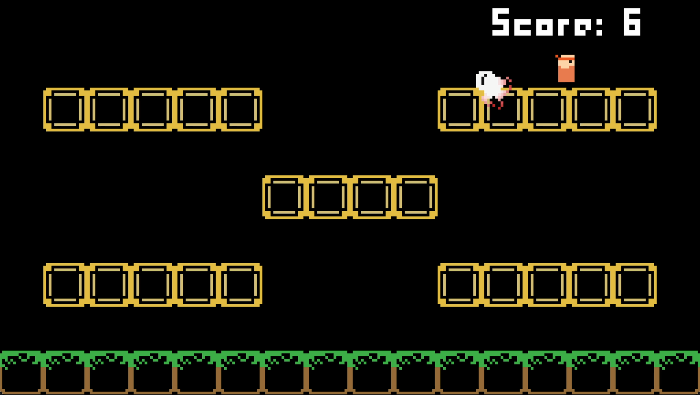

## Overview

This was a single-day hackathon at my university. We participated as a group of two where I was responsible for the programming and art and level design were done by my partner. The competition lasted around 8 hours.

The theme was “the game is a lie,” which provided some challenge. Eventually we decided to make a game where the enemy blinks in and out of vision, and the player must avoid the enemy for as long as possible by combining wall-jumps with the interesting level geometry.

Read more on [my site](https://thmsn.xyz/projects/tujgamejam/).
